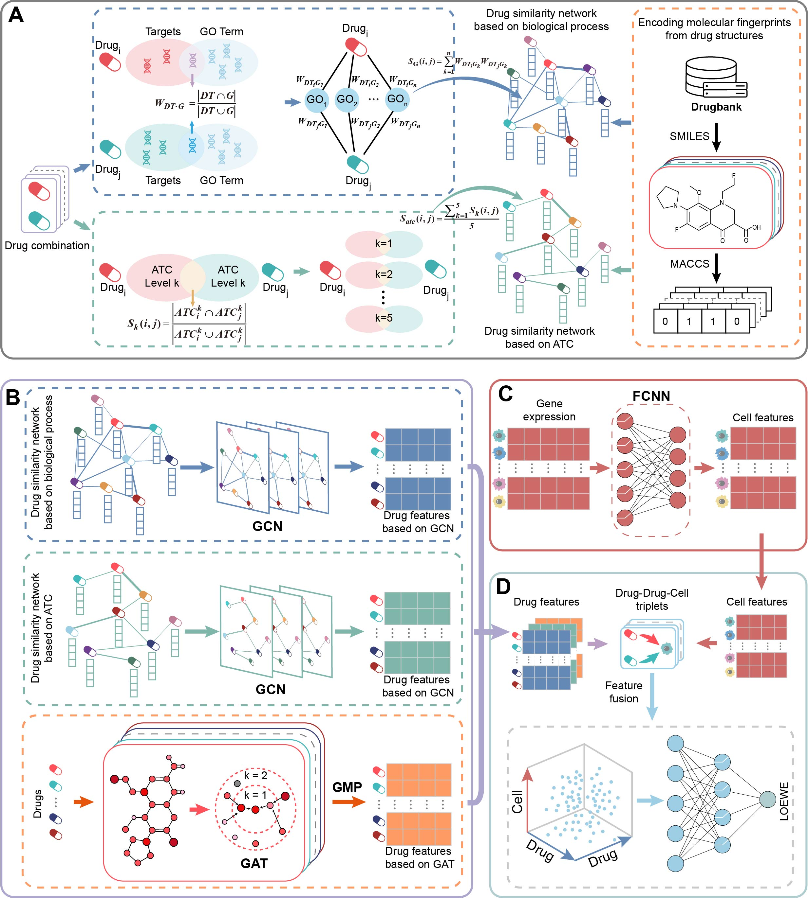

# DSimSynergy: An Interpretable Framework for Drug Synergy Prediction by integrating Functional and Clinical Drug Similarities
## 1.introduction
This repository contains source code and data for **DSimSynergy** 
**DSimSynergy** is a deep graph learning framework for predicting drug synergy in cancer cell lines. **DSimSynergy** constructs drug-drug similarity networks from biological functional and clinical application information, utilizes molecular fingerprints as initial embedding features of network nodes, and then leverages the graph convolutional networks to learn neighbor information from the similarity networks for optimizing drug representations. It subsequently encodes drug molecular structural features through graph attention networks and processes cell line gene expression data using fully connected neural networks. Finally, the learned embedding features based on drug similarity, molecular structure, and cell line are concatenated and integrated to predict the synergistic effect score for each drug-drug-cell line triplet.
Comprehensive benchmarking on multiple independent datasets demonstrates that **DSimSynergy** consistently outperforms state-of-the-art methods. Model interpretability analysis revealed key genes and pathways underlying drug synergy, while validation on clinical patient and cohort data demonstrated good clinical translational potential and discovered the molecular mechanisms by which drugs generate synergistic effects through "pathway complementary networks."
## 2.Design of DSimSynergy

